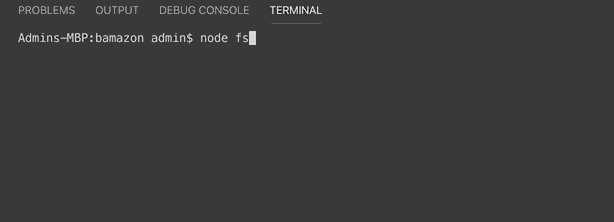

# Bamazon

Bamazon is a node application acting as store front to recieve orders and return the total according to the quantity amount.  The client enters a product number and the amount of units they want.  If product is in stock the total amount is display. If not insufficent quamtity is returned to the client.

## installation 

On the command line, in the package root directory, run the following commands to be installed in your application 

   1. npm install inquirer -save
   2. npm install mysql -save
   * make sure to have mysql downloaded on your machine

create a mysql database with table named products with 5 columns item id, product name, department name, price,stock quantity with accordingly rows.

create a connection to database using mysql node package

  

### Instructions 

    1. enter a item number 
    2. enter how many units you want 